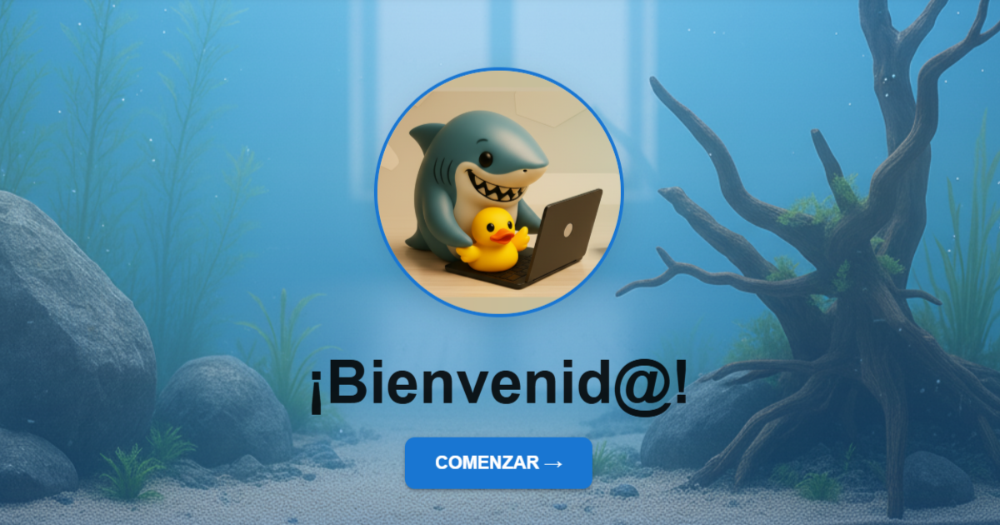

<h1 align="center">✨ Portfolio Interactivo de Desarrolladora</h1>

  <strong>Full Stack Developer & DevOps | React | Node.js | TypeScript | Docker</strong>

  <a href="https://aday-my-portfolio.vercel.app/" target="_blank">🌐 Ver Portfolio en Vivo</a> •
  <a href="https://github.com/Aday25?tab=repositories" target="_blank">📂 Ver Todos Mis Proyectos</a>

  

---

  
  

---

# Spanish

## 👾 Sobre Mi Portfolio

Este portfolio interactivo representa mi evolución como **Full Stack Developer & DevOps** después del bootcamp en **Factoría F5**. No es solo una galería de proyectos, sino una experiencia completa que refleja mi enfoque en **UX/UI, performance y código limpio**.

### ✨ Lo que encontrarás aquí:

- **🎨 Diseño único**: Tema de acuario interactivo con animaciones fluidas
- **🌍 Multilingüe**: Soporte completo español/inglés
- **📱 100% Responsive**: Optimizado para móvil, tablet y desktop
- **⚡ Performance**: Carga rápida y optimización SEO
- **🔧 Stack moderno**: React, TypeScript, Material-UI, Framer Motion
- **🎵 Experiencia inmersiva**: Sistema de audio personalizado
- **🎬 Demos completas**: Cada sección incluye demostraciones funcionales en vivo

## 🍿 Demo Principal

### [🌐 PORTFOLIO EN VIVO](https://aday-my-portfolio.vercel.app/)

**Navegación principal:**
- 🏠 **Inicio** - Presentación interactiva con elementos animados
- 👩‍💻 **Sobre mí** - Mi trayectoria y habilidades técnicas
- 💻 **Proyectos** - Bootcamp y proyectos personales con demos en vivo
- 🛠️ **Habilidades** - Stack tecnológico detallado y visualizado
- 📜 **Certificados** - Logros y formaciones profesionales
- 📞 **Contacto** - Conectemos profesionalmente con funcionalidades interactivas

## 🏆 Logros Técnicos Destacados

### ✅ **SEO & Social Media Optimizado**
- Meta tags optimizados para WhatsApp/LinkedIn
- Imágenes de preview personalizadas para redes sociales
- URLs canónicas y estructura SEO-friendly
- Vista previa automática al compartir enlaces

### ✅ **Performance Optimizado**
- Code splitting con React.lazy para carga rápida
- Lazy loading de imágenes y componentes
- Bundle optimizado (~150KB gzipped)
- Tiempos de carga inferiores a 2 segundos

### ✅ **UX/UI de Calidad**
- Sistema de temas oscuro/claro con persistencia
- Transiciones suaves con Framer Motion
- Diseño accesible (WCAG compliant)
- Navegación intuitiva y 100% responsive

### ✅ **Funcionalidades Avanzadas**
- Sistema de audio personalizado con controles
- Internacionalización completa (i18n)
- Descarga de CV en PDF en español e inglés
- Copia automática de email al portapapeles
- Demos interactivas en todas las secciones

## 🛠️ Stack Tecnológico

| Categoría | Tecnologías |
|-----------|-------------|
| **Frontend** | React 18, TypeScript, Material-UI, Framer Motion |
| **Routing** | React Router DOM v6 |
| **i18n** | react-i18next con soporte bilingüe |
| **Estilos** | CSS3, Material-UI Theming, animaciones personalizadas |
| **Deployment** | Vercel, GitHub Actions, CI/CD automatizado |
| **Herramientas** | ESLint, Prettier, Git, Docker |

## 📊 Métricas de Calidad

- **🚀 Lighthouse Score**: 95+ en Performance, Accessibility, Best Practices
- **📱 Mobile-Friendly**: 100% responsive en todos los dispositivos
- **⚡ Tiempo de carga**: < 2s en conexión 3G
- **🔍 SEO**: Meta tags optimizados para todas las redes sociales
- **♿ Accesibilidad**: Cumplimiento WCAG 2.1 AA

## 💻 Mis Proyectos Destacados

### [🟡 **SprintFlow** - Gestión Ágil para Equipos](https://github.com/Aday25/sprintflow)
**Nov 2025 • Full Stack | React | Node.js | MongoDB | Material UI**
Sistema de gestión ágil para equipos de desarrollo con métricas en tiempo real, autenticación JWT, tableros Kanban y roles de equipo.

### [🌊 **El Gran Azul** - Biología Marina Interactiva](https://github.com/Aday25/el-gran-azul)
**Oct 2025 • Full Stack | TypeScript | React | Material UI | APIs**
Aplicación web educativa sobre biología marina desarrollada con TypeScript, consumo de APIs REST, diseño moderno con Material UI y contenido interactivo.

### [🔮 **Tarot Científico** - Fusión de Tarot y Ciencia](https://github.com/Aday25/tarot-cientifico)
**Ago 2025 • React | JavaScript | CSS3 | Hooks**
Aplicación React que combina cartas de tarot con científicas históricas, utilizando React Hooks, componentes reutilizables y diseño responsive.

### [🦈 **Chompy The Game** - Aprendizaje de Programación](https://github.com/Aday25/chompy-the-game)
**Jul 2025 • JavaScript | OOP | Canvas | Game Development**
Juego educativo para aprender programación orientada a objetos con Canvas API, animaciones fluidas y desarrollo completo de videojuegos.

### [💊 **Sanimed** - Gestión Hospitalaria](https://github.com/Aday25/sanimed)
**Full Stack | React | Node.js | MySQL | Gestión de Usuarios**
Sistema completo de gestión hospitalaria con roles de usuario, citas online, dashboard administrativo y panel de pacientes.

### [📚 **Más Proyectos**](https://github.com/Aday25?tab=repositories)
Explora todos mis proyectos con código abierto, documentación completa y demos en vivo.

## 🎨 Créditos Creativos

### 🎵 **Elementos Multimedia del Portfolio**
- **Música ambiental**: Compuesta con Suno AI para crear una atmósfera submarina única
- **Imágenes y assets**: Generados con Nano Banana y Copilot Design
- **Animaciones**: Desarrolladas con Framer Motion y CSS personalizado
- **Demos interactivas**: Todas las páginas incluyen demostraciones funcionales en vivo

### 🌊 **Experiencia Inmersiva**
Cada sección del portfolio está diseñada para ofrecer una experiencia coherente y envolvente, desde las animaciones del acuario hasta la música ambiental que acompaña la navegación.

## 📞 Conectemos

  
  
  
  

## 🙏 Agradecimientos

- **Factoría F5** por la formación integral como desarrolladora
- **Mentores y compañeros** que hicieron posible este crecimiento
- **Comunidad tech** por el constante apoyo y colaboración

## 🙋🏻‍♀️ Cierre

Este portfolio no solo muestra mis habilidades técnicas, sino también mi capacidad para integrar diversas herramientas y crear experiencias digitales completas. Desde el código hasta la creatividad, cada elemento ha sido cuidadosamente seleccionado para representar mi enfoque integral del desarrollo web.

**Explora, interactúa y descubre más en cada sección.**

  <strong>✨ Transformando ideas en experiencias digitales ✨</strong>

  <em>Última actualización: Diciembre 2025</em>

---

# English

## 👾 About My Portfolio

This interactive portfolio represents my evolution as a **Full Stack Developer & DevOps** after completing the **Factoría F5 bootcamp**. It's not just a project gallery, but a complete experience reflecting my focus on **UX/UI, performance, and clean code**.

### ✨ What you'll find here:

- **🎨 Unique Design**: Interactive aquarium theme with fluid animations
- **🌍 Multilingual**: Full Spanish/English support
- **📱 100% Responsive**: Optimized for mobile, tablet, and desktop
- **⚡ Performance**: Fast loading and SEO optimization
- **🔧 Modern Stack**: React, TypeScript, Material-UI, Framer Motion
- **🎵 Immersive Experience**: Custom audio system
- **🎬 Complete Demos**: Each section includes live functional demonstrations

## 🍿 Live Demo

### [🌐 LIVE PORTFOLIO](https://aday-my-portfolio.vercel.app/)

**Main Navigation:**
- 🏠 **Home** - Interactive introduction with animated elements
- 👩‍💻 **About Me** - My journey and technical skills
- 🚀 **Projects** - Bootcamp and personal projects with live demos
- 🛠️ **Skills** - Detailed and visualized tech stack
- 📜 **Certificates** - Professional achievements and training
- 📞 **Contact** - Professional connection with interactive features

## 🏆 Technical Achievements

### ✅ **SEO & Social Media Optimized**
- Optimized meta tags for WhatsApp/LinkedIn
- Custom preview images for social networks
- Canonical URLs and SEO-friendly structure
- Automatic preview when sharing links

### ✅ **Performance Optimized**
- Code splitting with React.lazy for fast loading
- Lazy loading of images and components
- Optimized bundle (~150KB gzipped)
- Load times under 2 seconds

### ✅ **Quality UX/UI**
- Dark/light theme system with persistence
- Smooth transitions with Framer Motion
- Accessible design (WCAG compliant)
- Intuitive and 100% responsive navigation

### ✅ **Advanced Features**
- Custom audio system with controls
- Complete internationalization (i18n)
- PDF CV download in Spanish and English
- Automatic email copy to clipboard
- Interactive demos in all sections

## 🛠️ Tech Stack

| Category | Technologies |
|----------|-------------|
| **Frontend** | React 18, TypeScript, Material-UI, Framer Motion |
| **Routing** | React Router DOM v6 |
| **i18n** | react-i18next with bilingual support |
| **Styling** | CSS3, Material-UI Theming, custom animations |
| **Deployment** | Vercel, GitHub Actions, automated CI/CD |
| **Tools** | ESLint, Prettier, Git, Docker |

## 📊 Quality Metrics

- **🚀 Lighthouse Score**: 95+ in Performance, Accessibility, Best Practices
- **📱 Mobile-Friendly**: 100% responsive on all devices
- **⚡ Load Time**: < 2s on 3G connection
- **🔍 SEO**: Optimized meta tags for all social networks
- **♿ Accessibility**: WCAG 2.1 AA compliance

## 💻 Featured Projects

### [🟡 **SprintFlow** - Agile Team Management](https://github.com/Aday25/sprintflow)
**Nov 2025 • Full Stack | React | Node.js | MongoDB | Material UI**
Agile management system for development teams with real-time metrics, JWT authentication, Kanban boards, and team roles.

### [🌊 **El Gran Azul** - Interactive Marine Biology](https://github.com/Aday25/el-gran-azul)
**Oct 2025 • Full Stack | TypeScript | React | Material UI | APIs**
Educational web application about marine biology developed with TypeScript, REST API consumption, modern Material UI design, and interactive content.

### [🔮 **Scientific Tarot** - Tarot & Science Fusion](https://github.com/Aday25/tarot-cientifico)
**Aug 2025 • React | JavaScript | CSS3 | Hooks**
React application that combines tarot cards with historical female scientists, using React Hooks, reusable components, and responsive design.

### [🦈 **Chompy The Game** - Programming Learning](https://github.com/Aday25/chompy-the-game)
**Jul 2025 • JavaScript | OOP | Canvas | Game Development**
Educational game to learn object-oriented programming with Canvas API, fluid animations, and complete video game development.

### [💊 **Sanimed** - Hospital Management](https://github.com/Aday25/sanimed)
**Full Stack | React | Node.js | MySQL | User Management**
Complete hospital management system with user roles, online appointments, administrative dashboard, and patient panel.

### [📚 **More Projects**](https://github.com/Aday25?tab=repositories)
Explore all my projects with open source code, complete documentation, and live demos.

## 🎨 Creative Credits

### 🎵 **Portfolio Multimedia Elements**
- **Ambient music**: Composed with Suno AI to create a unique underwater atmosphere
- **Images and assets**: Generated with Nano Banana and Copilot Design
- **Animations**: Developed with Framer Motion and custom CSS
- **Interactive demos**: All pages include live functional demonstrations

### 🌊 **Immersive Experience**
Each portfolio section is designed to offer a consistent and engaging experience, from aquarium animations to ambient music that accompanies navigation.

## 📞 Let's Connect

  
  
  
  

## 🙏 Acknowledgments

- **Factoría F5** for comprehensive developer training
- **Mentors and peers** who made this growth possible
- **Tech community** for constant support and collaboration

## 🙋🏻‍♀️Closing

This portfolio not only showcases my technical skills but also my ability to integrate diverse tools and create complete digital experiences. From code to creativity, every element has been carefully selected to represent my comprehensive approach to web development.

**Explore, interact, and discover more in each section.**

  <strong>✨ Transforming ideas into digital experiences ✨</strong>

  <em>Last updated: December 2025</em>

---

  

